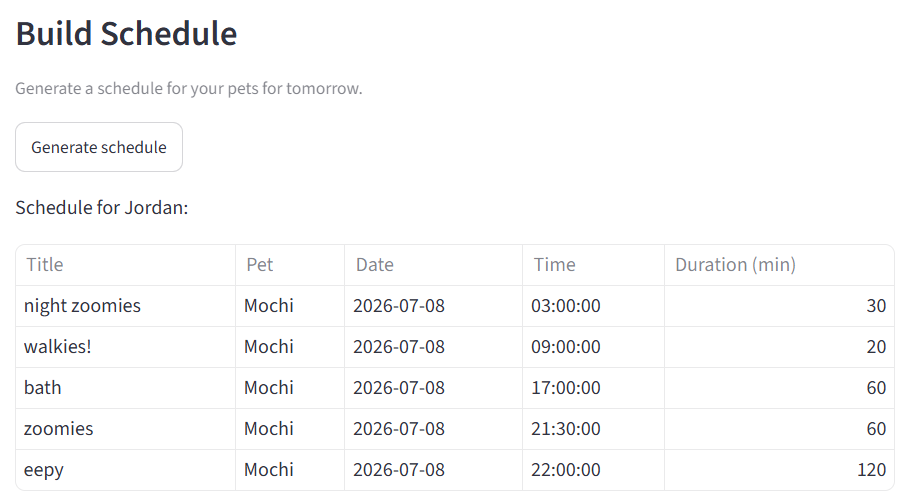
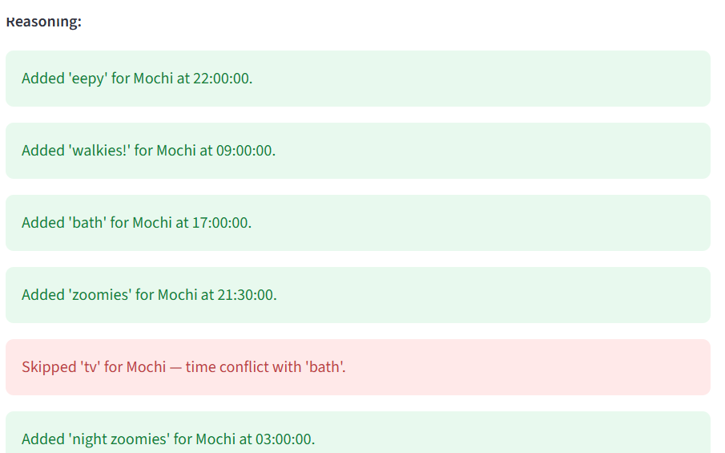

# PawPal+ (Module 2 Project)

You are building **PawPal+**, a Streamlit app that helps a pet owner plan care tasks for their pet.

## Scenario

A busy pet owner needs help staying consistent with pet care. They want an assistant that can:

- Track pet care tasks (walks, feeding, meds, enrichment, grooming, etc.)
- Consider constraints (time available, priority, owner preferences)
- Produce a daily plan and explain why it chose that plan

Your job is to design the system first (UML), then implement the logic in Python, then connect it to the Streamlit UI.

## What you will build

Your final app should:

- Let a user enter basic owner + pet info
- Let a user add/edit tasks (duration + priority at minimum)
- Generate a daily schedule/plan based on constraints and priorities
- Display the plan clearly (and ideally explain the reasoning)
- Include tests for the most important scheduling behaviors

## Getting started

### Setup

```bash
python -m venv .venv
source .venv/bin/activate  # Windows: .venv\Scripts\activate
pip install -r requirements.txt
```

### Suggested workflow

1. Read the scenario carefully and identify requirements and edge cases.
2. Draft a UML diagram (classes, attributes, methods, relationships).
3. Convert UML into Python class stubs (no logic yet).
4. Implement scheduling logic in small increments.
5. Add tests to verify key behaviors.
6. Connect your logic to the Streamlit UI in `app.py`.
7. Refine UML so it matches what you actually built.

## 🖥️ Sample Output

Paste a sample of your app's CLI or Streamlit output here so a reader can see what a generated plan looks like:

**Example CLI output:** (Streamlit output is formatted cleanly as a table; see images)
```
Tomorrow's Generated Schedule
~~~~~~~~~~~~~~~~~~~~~~~~~~~~~~
Task(title='Vet visit', date=datetime.date(2026, 7, 7), time=datetime.time(10, 30), duration=200, priority=<Priority.VERY_HIGH: 5>, frequency=<Frequency.ONE_TIME: 'one-time'>, completed=False)
Task(title='walkies!', date=datetime.date(2026, 7, 7), time=datetime.time(8, 0), duration=60, priority=<Priority.HIGH: 4>, frequency=<Frequency.DAILY: 'daily'>, completed=False)
Task(title='brushing', date=datetime.date(2026, 7, 7), time=datetime.time(14, 0), duration=15, priority=<Priority.MEDIUM: 3>, frequency=<Frequency.WEEKLY: 'weekly'>, completed=False)
Task(title='??????????', date=datetime.date(2026, 7, 7), time=datetime.time(20, 0), duration=30, priority=<Priority.MEDIUM: 3>, frequency=<Frequency.ONE_TIME: 'one-time'>, completed=False)
Task(title="steal dad's socks", date=datetime.date(2026, 7, 7), time=datetime.time(8, 0), duration=9999, priority=<Priority.LOW: 2>, frequency=<Frequency.DAILY: 'daily'>, completed=False)

Scheduling Reasoning
~~~~~~~~~~~~~~~~~~~~~~~~~~~~~~
Added 'Vet visit' for Spot at 10:30:00.
Added 'walkies!' for Dot at 08:00:00.
Skipped 'Bath Time' for Spot — time conflict with 'Vet visit'.
Added 'brushing' for Pip at 14:00:00.
Added '??????????' for Lord Biscuit Mc-Stinkypaws III at 20:00:00.
Added 'steal dad's socks' for Lord Biscuit Mc-Stinkypaws III at 08:00:00.
Skipped 'Nap (do not disturb or else)' for Lord Biscuit Mc-Stinkypaws III — time conflict with 'Vet visit'.
```

## 🧪 Testing PawPal+

```bash
# Run the full test suite:
python3 -m pytest

# Run with coverage:
python3 -m pytest --cov
```

Sample test output:

```
============================= test session starts ==============================
platform linux -- Python 3.12.3, pytest-9.0.3, pluggy-1.6.0 -- /home/aabedin/CodePath/codepath_venv/bin/python
cachedir: .pytest_cache
rootdir: /home/aabedin/CodePath/ai110-module2show-pawpal-starter
plugins: anyio-4.13.0
collecting ... collected 43 items

tests/test_pawpal.py::test_mark_complete_changes_status PASSED           [  2%]
tests/test_pawpal.py::test_add_task_increases_pet_task_count PASSED      [  4%]
tests/test_pawpal.py::test_sort_by_time_ascending PASSED                 [  6%]
tests/test_pawpal.py::test_sort_by_time_none_times_sort_last PASSED      [  9%]
tests/test_pawpal.py::test_sort_by_date_ascending PASSED                 [ 11%]
tests/test_pawpal.py::test_sort_by_date_none_dates_sort_last PASSED      [ 13%]
tests/test_pawpal.py::test_sort_by_priority_descending PASSED            [ 16%]
tests/test_pawpal.py::test_sort_by_time_with_priority_tie_break PASSED   [ 18%]
...
tests/test_pawpal.py::test_pet_remove_task_removes_from_list PASSED      [ 93%]
tests/test_pawpal.py::test_full_flow_owner_pet_task_to_schedule PASSED   [ 95%]
tests/test_pawpal.py::test_full_flow_multiple_pets_conflict_resolution PASSED [ 97%]
tests/test_pawpal.py::test_full_flow_complete_and_reschedule PASSED      [100%]

============================== 43 passed in 0.11s ==============================
```
(full test output available in tests/test\_output\_full.md)


## 📐 Smarter Scheduling

> Fill in once you've implemented scheduling logic.

| Feature | Method(s) | Notes |
|---------|-----------|-------|
| Task sorting | Scheduler.sort_by_date, Scheduler.sort_by_time, Scheduler.sort_by_priority | Sorting criteria can include date, time (separate), and priority |
| Task sorting with tiebreakers | Scheduler.sort_by_time_with_priority, Scheduler.sort_by_priority_with_time | More complex sorting: uses one criterion with another to settle tiebreakers |
| Filtering | Scheduler.filter_by_completed, Scheduler.filter_by_date, Scheduler.filter_by_pet | Filtering criteria can include completion status, specific date, and pet |
| Conflict handling | Scheduler.generate_schedule | Checks for overlapping time slots when adding a new task and may skip it accordingly |
| Recurring tasks | Task.mark_complete | If frequency is daily or weekly, automatically populates a new Task with identical attributes and appropriate time |

## 📸 Demo Walkthrough

Describe your app in numbered steps so a reader can follow along without watching a video:

1. Add an owner by typing in their name. Select the current owner using the box above.
2. Add an owner's pet by typing in their name and species. Select the current pet using the box above.
3. Add a pet's task by filling in the task name, start time, duration, priority, and frequency.
    a. A frequency of "Weekly" or "One-time" will also prompt a day of week or specific date respectively.
4. Click "Generate Schedule" to see all tasks for the next day arranged in a table, followed by reasoning and feedback about what tasks could/could not be scheduled and why.

**Screenshot or video** *(optional)*:


